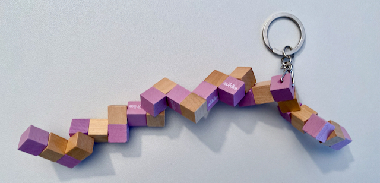
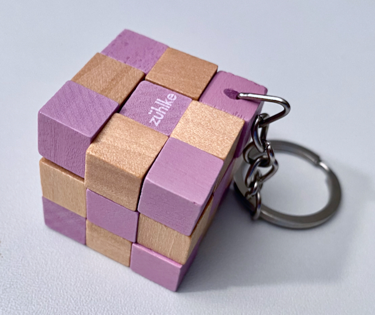

# Solver for the Snake Cube Puzzle




For the snake of the shape (`-` is straight, `.` is corner) 

```
--...-..-...-.-....-.-.-.--
```
it prints two solutions. It starts on the top left at x/y/z 0/0/0.  
```
winners:

Y\X  Z0     Z1     Z2
     ↓→Z    →zZ    ↓←←    
     ↓Z↓    ↑Zz    ↓→z    
     →↑Z    ↑←←    →→→    
     
Y\X  Z0     Z1     Z2
     ↓Z↓    Z←z    →→z    
     ↓↑↓    →→Z    ↓←←    
     Z↑Z    ↑zZ    →zZ    
     
```

But it also works with any other snake shape and cube size. 

## See also
 - https://www.jaapsch.net/puzzles/snakecube.htm